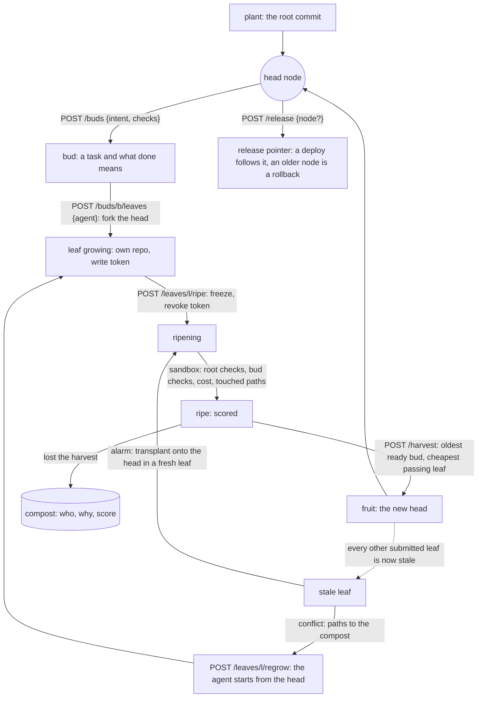
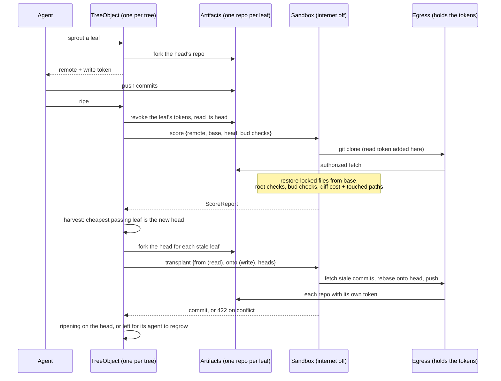

# Ficus 🌿

A Rust git platform for agents, built on Cloudflare Workers and Artifacts.

Entry for Cloudflare's [next git platform](https://blog.cloudflare.com/next-git-platform-on-cloudflare)
challenge (submissions close 2026-10-14).

## The tree

Work grows outward from an accepted commit and never merges back.

- A **bud** is a task: an intent, plus the bud's own **checks** that say when it is done.
  They never live in the repository, so no attempt can change them.
- Agents (or people) grow competing **leaves** for a bud, each in its own repository
  forked from the head. A submitted leaf is frozen and scored in a sandbox: the root's
  checks (what must not break), then the bud's (what must be done), then the diff's size.
- **Harvest** turns the cheapest passing leaf into **fruit**, the new head. The oldest
  ready bud harvests first, so no bud starves.
- Every other submitted leaf is now **stale**: checked against a head that no longer
  exists. The tree **transplants** it: replays its commits onto the new head in a fresh
  leaf and scores it there, with no agent involved. Only a conflict sends the leaf back to
  its agent to **regrow** from the head, with the **compost** (every earlier attempt, why
  it lost, how it scored) in hand. A bud regrows a bounded number of times; after that its
  planter splits it or withers it.
- A **release** is a pointer at a node. History is linear and every node passed the same
  checks, so a rollback is the pointer moving back.

### A leaf's life



### What runs where



## Develop

Needs [nix](https://nixos.org) + [devenv](https://devenv.sh).

```sh
direnv allow          # or: devenv shell
just test             # native tests
just dev              # wrangler dev on the main Worker
just git-dev          # wrangler dev on the emscripten git engine
just fl               # fmt + clippy (native and wasm32)
```

## Layout

- `crates/ficus-core` — domain logic, no Workers APIs, tested natively
- `crates/ficus-worker` — the main Worker (`workers-rs`, `wasm32-unknown-unknown`)
- `crates/ficus-git` — the git engine Worker on the experimental
  [`wasm32-unknown-emscripten`](https://blog.cloudflare.com/rust-workers-emscripten-target/)
  target: libc + an in-memory filesystem, so `std::fs` and C-backed crates work.
  Standalone crate (own lockfile) built with `worker-build --emscripten`.

## Infra and lint

- `infra/` deploys with [alchemy](https://alchemy.run) (`just deploy`) and is Effect throughout.
- `just infra-check`: typecheck, then oxlint with `@effect/tsgo`'s type-aware rules and the
  vendored [anti-slop](https://github.com/dmmulroy/anti-slop) rules (generic + Effect).
- `just clef-review`: asks Cloudflare's [Clef](https://blog.cloudflare.com/clef-decision-models/)
  decision model the judgement calls a linter cannot make (restating comments, swallowed
  failures, unparsed boundaries, tests that cannot fail) about changed TypeScript.

Credentials go in `~/.config/ficus/.env` (`CLOUDFLARE_ACCOUNT_ID`, `CLOUDFLARE_API_TOKEN`).

## CI/CD

- Every pull request and push: `ci.yml` (Rust fmt, clippy on native/wasm32/emscripten, tests; infra
  typecheck, lint, tests; actionlint and zizmor on the workflows).
- Deploys follow [alchemy's CI guide](https://alchemy.run/guides/ci/): each pull request gets its own
  `pr-<n>` stage (with a comment linking it, and the end-to-end smoke test), destroyed when it closes;
  `main` deploys `prod`.
- Credentials are code: `cd infra && bun run deploy:bootstrap` (once, with a Cloudflare credential that
  can create API tokens and a GitHub token with admin on the repo) mints a scoped CI token and writes
  the repository secrets. Until it has run, deploys skip.

## License

MIT
